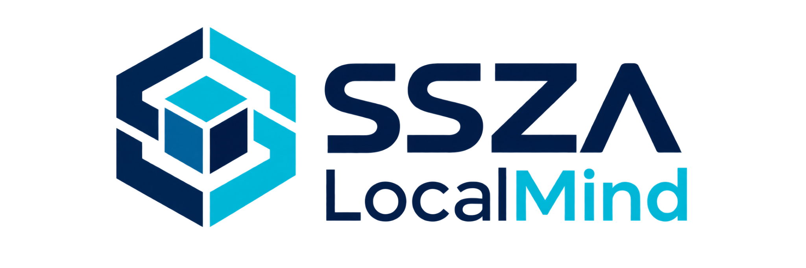
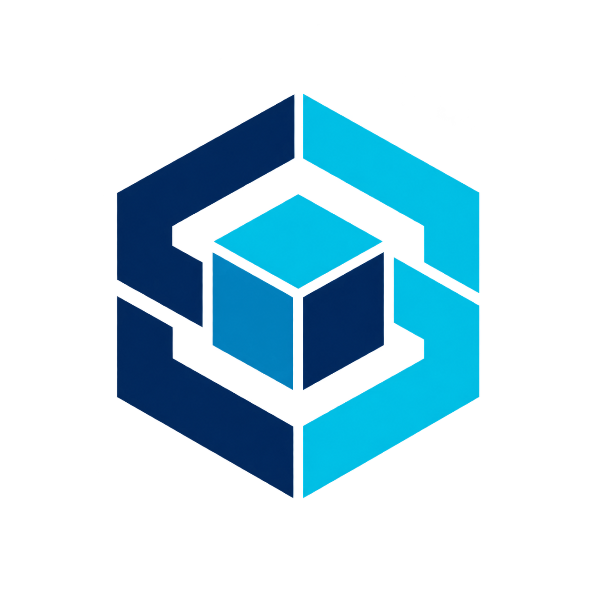

<div align="center">



<br>

# SSZA LocalMind

### Inteligencia artificial local para trabajar con tus documentos, conocimiento y herramientas directamente en tu computadora

**Windows · Procesamiento local · Modo offline · Documentos · Código · Automatización**

<br>

[](../../releases/latest)
[](../../releases)


<br>

**Desarrollado por SSZA - Design**

</div>

---

## ¿Qué es SSZA LocalMind?

**SSZA LocalMind** es un asistente de inteligencia artificial para Windows diseñado para trabajar directamente desde tu computadora.

Permite conversar con una IA local, analizar documentos, consultar información de tu propia biblioteca, trabajar con código y utilizar herramientas autorizadas desde un mismo entorno.

LocalMind está pensado para que el **modelo, los documentos, el historial y el conocimiento de trabajo puedan mantenerse localmente en tu equipo**, reduciendo la dependencia de servicios externos.

> 🔒 **Tus documentos y el procesamiento principal pueden permanecer dentro de tu computadora.**

---

## ¿Qué puede hacer?

### 💬 Asistente de IA local

Conversa con un modelo de inteligencia artificial ejecutado directamente en tu computadora.

Puede ayudarte a:

- Explicar temas y responder preguntas.
- Resumir y analizar información.
- Redactar contenido.
- Generar ideas.
- Resolver tareas técnicas.
- Mantener el contexto de tus proyectos.

---

### 📚 Trabajar con tus documentos

LocalMind puede utilizar información que agregas a su biblioteca de conocimiento.

Está diseñado para trabajar con archivos como:

- **PDF**
- **DOCX**
- **TXT**
- Documentación técnica
- Archivos de texto
- Archivos de código fuente

Puedes utilizar manuales, libros, apuntes, documentación y otros archivos como contexto para tus consultas.

> 📖 Construye tu propia biblioteca local de conocimiento y consúltala desde LocalMind.

---

### 📎 Analizar archivos desde el chat

Puedes agregar documentos y archivos directamente dentro de una conversación para:

- Resumir documentos.
- Buscar información importante.
- Explicar contenido.
- Revisar código.
- Relacionar información entre archivos.
- Trabajar sobre archivos dentro del contexto activo.

---

### 💻 Programación y asistencia técnica

LocalMind también está orientado al trabajo técnico.

Puede ayudarte con:

```text
PowerShell
CMD / Batch
Python
C#
JavaScript
HTML / CSS
SQL
Algoritmos
Archivos de configuración
Scripts de automatización
```

Las capacidades dependen del modelo local instalado y de los recursos del equipo.

---

### ⚙️ Herramientas y automatización

LocalMind está diseñado para ir más allá de un chat tradicional.

Puede utilizar herramientas locales autorizadas para colaborar con determinadas tareas dentro de Windows.

```text
Usuario
   ↓
SSZA LocalMind
   ↓
Analiza la solicitud
   ↓
Genera una acción o archivo
   ↓
Utiliza herramientas autorizadas
   ↓
Resultado
```

Las acciones sensibles deben mantenerse bajo control del usuario.

---

## 🧠 Memoria e historial local

Las conversaciones pueden conservarse localmente para poder regresar posteriormente a ellas.

LocalMind está diseñado para mantener:

- Historial de conversaciones.
- Contexto activo.
- Información de proyectos.
- Biblioteca de conocimiento.
- Archivos relacionados.
- Preferencias y configuración local.

Esto permite continuar un trabajo sin comenzar desde cero cada vez que abras la aplicación.

---

## 🔐 Privacidad y procesamiento local

Uno de los objetivos principales de **SSZA LocalMind** es reducir la dependencia de servicios externos.

Cuando utilizas un modelo instalado localmente:

```text
Tu pregunta
     ↓
SSZA LocalMind
     ↓
Modelo de IA en tu PC
     ↓
Respuesta
```

El procesamiento principal puede realizarse dentro del propio equipo.

### LocalMind prioriza

- 🔒 Procesamiento local.
- 📁 Archivos almacenados localmente.
- 🧠 Modelos ejecutados en el equipo.
- 🗂️ Historial persistente local.
- ⚙️ Herramientas controladas por el usuario.
- 🌐 Funcionamiento sin conexión después de preparar el entorno compatible.

> Algunas funciones, descargas iniciales, modelos, actualizaciones o integraciones opcionales pueden requerir conexión a Internet.

---

## 🖥️ Requisitos generales

| Componente | Consideración |
|---|---|
| Sistema operativo | Windows 10 / Windows 11 |
| Arquitectura | 64 bits |
| Procesador | CPU compatible de 64 bits |
| Memoria RAM | Depende del modelo utilizado |
| GPU | Opcional |
| Almacenamiento | Depende de los modelos y documentos |
| Internet permanente | No requerido para el funcionamiento local preparado |

> El rendimiento y la calidad de las respuestas dependen del modelo seleccionado y del hardware disponible.

---

## 🚀 Instalación

1. Entra en **Releases**.
2. Descarga la última versión disponible de SSZA LocalMind.
3. Ejecuta el instalador.
4. Completa la configuración inicial.
5. Instala o selecciona un modelo local compatible.
6. Abre LocalMind y comienza a trabajar.

<div align="center">

[](../../releases/latest)

</div>

---

## 🌐 Trabajo offline

Una vez preparados los componentes y el modelo necesarios, LocalMind puede utilizarse sin una conexión permanente a Internet.

Está pensado para escenarios como:

- Equipos de trabajo aislados.
- Centros educativos.
- Laboratorios.
- Entornos técnicos.
- Computadoras con conectividad limitada.
- Usuarios que prefieren mantener sus documentos localmente.

---

## 📂 Biblioteca de conocimiento

Ejemplo de organización:

```text
Biblioteca LocalMind
│
├── Matemáticas
│   ├── Álgebra.pdf
│   └── Cálculo.pdf
│
├── Programación
│   ├── CSharp.docx
│   ├── Python.pdf
│   └── Ejemplos.cs
│
├── Manuales
│   ├── Equipo_A.pdf
│   └── Procedimientos.docx
│
└── Proyectos
    ├── Proyecto_01
    └── Proyecto_02
```

---

## 🧩 Principios del proyecto

**LOCAL**  
La inteligencia artificial debe poder ejecutarse en el equipo del usuario.

**ÚTIL**  
Debe servir para trabajo real y no limitarse únicamente a conversar.

**CONTROLABLE**  
El usuario conserva el control de sus archivos, herramientas y acciones.

**ESCALABLE**  
Debe poder funcionar con equipos modestos y aprovechar hardware más potente cuando esté disponible.

---

## ⚠️ Consideraciones

SSZA LocalMind utiliza modelos de inteligencia artificial que pueden cometer errores o generar información incorrecta.

Las respuestas deben revisarse antes de utilizarlas en decisiones importantes, tareas profesionales o procedimientos técnicos donde un error pueda tener consecuencias relevantes.

Las capacidades pueden variar según el modelo instalado, memoria RAM, procesador, GPU, configuración y tamaño de los documentos procesados.

---

## 🛠️ Estado del proyecto

SSZA LocalMind continúa en desarrollo activo.

Las nuevas versiones pueden incorporar mejoras relacionadas con rendimiento, análisis documental, gestión de conocimiento, herramientas locales, automatización, interfaz, compatibilidad con modelos, voz y capacidades multimodales.

---

<div align="center">



### SSZA LocalMind

**Tu conocimiento. En tu computadora.**

Procesamiento local · IA offline · Documentos · Código · Herramientas

<br>

**Design by SSZA**

</div>
